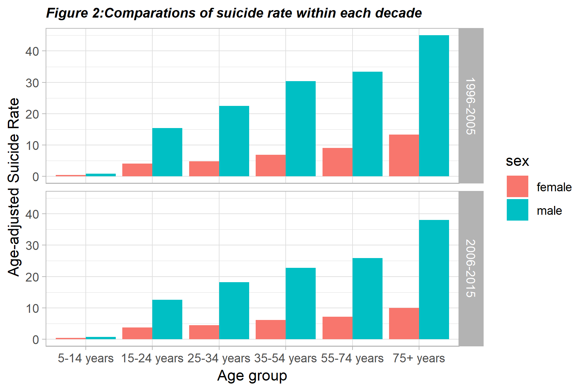
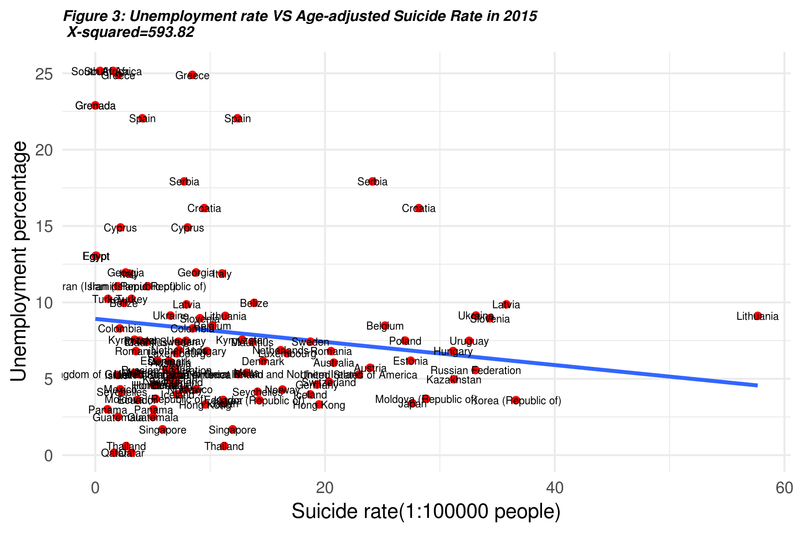

```{r setup, include=FALSE, warning=FALSE}
#knitr::opts_chunk$set(echo = TRUE)
library(tidyverse)
library(dplyr)
library(stringdist)
library(plotly)
library(knitr)
```

In this project, I will use three datasets. One is WHO suicide statistics in 1979-2016, the second is a mapping from countries to continents. The third is the unemployment rate in 1960-2017 from the World Bank.

*suicide: Basic historical (1979-2016) data by country, year, age groups and sex. 

    *suicide_no: the number of suicide

    *population: population in each age and sex group.

*continent:  It has 249 observations and 11 variables.

    *name: Country name

    *region: Continent name

    *alpha.2: two character code of countries

    *alpha.3: three character code of countries

*unemploy: Contain information of unemployment rate within each country. It has 264 observations and 63 variables.

     *Country.Name: Country name

     *Country.Code: three character code of countries

     *Xxxxx: unemployment rate in xxxx year.
     
The first and second dataset has a common attribute-countries' name
The second and third dataset has a common attribut-three character code of countries

we want to match up Countries with slight variations in spelling so that the join works better in case some countries name is misspelled in suicide dataset. So I create a function `find_best_name` to find the closest name for a single country which is stored in `find_bestname_function.R`. Then using for loop to find closest names  for all countries.

###where is the most vulnerable demographic place?
####Join the first and second dataset with a common attribute countries' name.

```{r warning=FALSE}
source('Join_12data.R')
```

First, we want to have an overall understanding of basic facts about suicide. 

So, I want to identify the demographic most likely to commit suicide recently. Since the data of 2016 is missing a lot, we choose 2015 as standard year to draw a 3D map and list table to identify the most 10 vulnerable demographic within world

```{r warning=FALSE}
#Filter year to generate dataset contains 2015 data values and create a new variable `suicide_rate`used by WHO.to calculate suicide rate whose definition is age-standardized rates(per 100k people)

source('Suicide_2015_world.R')
source('3Dmap.R')
p<- readRDS("worldmap.rds")
p
#List the most 10 vulnerable demographic within world
source('top10_suicide_places.R')
a<-readRDS("top10_suicide_places.rds")
a
```


No matter from the 3D map or data.frame listed above, we both easily find places with high suicide rates is concentrate in Europe and  `Lithuania` has the highest age-adjusted suicide rate(ignoring missing value), which details could be found in [Lithuania Has Among the Highest Suicide Rates in the World](https://theculturetrip.com/europe/lithuania/articles/this-country-has-among-the-highest-suicide-rates-in-the-world/). The reason of that may be caused by weather which is rainy and cold for most of the time, the collapse of the Soviet Union and Alcoholism.


###who is at risk?
The core of my analysis is a comparison between the recent rates of suicide versus the beginning of the 21st century, which I define as the 1996-2005 period, while by 'recent' I mean the 2006-2015 decade.  Furthermore, I use the median rate in a decade as a representative for that decade because we already know there is a slight difference in suicide rate over time. So we first get every year suicide rate and find median one within decades. This way we should be protected from noise, that is fluctuations between single years that may not capture significant changes in major factors and mechanisms responsible for suicides. 

```{r warning=FALSE}
source('compare_by_decade.R')
```



From the histogram above, we find that the older age group the higher age-adjusted suicide rate. And More men commit suicide than women of all ages. The median Age-adjusted suicide rate in 1996-2005 is a bit higher than 2006-2015 among all age groups.

### What factors influence suicide behavior?
First, we want to test whether there exists an association between sex and suicide rate. So using `prop.test` function to test the null that the proportions (probabilities of suicide) in sex groups are the same according to the data from 2015 which is a representative year of recent. An alternative hypothesis is male has higher proportions commit suicide than women.

```{r warning=FALSE}
source('Suicide_2015_world.R')
#Generate data.frame group by sex and whether suicide or not from data values in 2015.
by_sex<-group_by(suicide_2015_world,sex)
suicide_test<-summarise(by_sex,suicide=sum(number),total=sum(population_total)) %>% 
  mutate(no_suicide=total-suicide) %>% select(-total,-sex)

#Using normal distribution test by `prop.test` to test two sample independence.
prop.test(x=as.matrix(suicide_test),alternative="less",correct = TRUE)
```

With a p value of less than 2.2e-16 which is far less than 0.05, we have evidence to reject the null hypothesis at a 5% level of significance. We conclude that men are far more prone to commiting suicide than women.


Except for sex, people choose to end their lives for complex reasons. Since figure 3 shows that people are likely to suicide when they get older, and we also know people have higher unemployment rate when they get older. Hence, in order to investigate whether there is an association between unemployment and suicide, we use 2015 data from dataset `unemploy` to take a chisq test and draw a linear graph.

```{r warning=FALSE}
source('Suicide_2015_world.R')
#join the first two datasets and the third dataset with the comman attribute `Three letter Country Code`
unemploy=read.csv("unemploy.csv")
unemploy_2015=unemploy %>% select(Country.Code,X2015)
#chisq test
Test_2015_world=suicide_2015_world%>% inner_join(unemploy_2015,by=c("alpha.3"="Country.Code")) %>%filter(!is.na(X2015))
chisq.test(Test_2015_world[,7:8])
```


The figure above demonstrates the relationship between unemployment and suicide rates state by state in 2015. Interestingly, the result suggests the opposite from what we hypothesis. We see a negative linear relationship with the infinitely small p-value. Hence, we reject the null and conclude that people are more likely to suicide when they have jobs. That may be because of unbearable pressure from work and also implies that the reason for people suicide when they are old is because of something else.

#Communicate results
In order to have a general understanding of suicide situation in the world, e.g where is the most vulnerable demographic place? Is it getting worse or better versus the beginning of the 21st century? who is at risk? What factors influence suicide behavior?
First, we use 2015 as a standard year to draw a map and list table to find top 10 vulnerable demographic places because of many countries have missing values in 2016. And find that vulnerable demographic places are concentrated in Europe.
Second, we look at the trend of suicide rate over time within each continent and find that suicide rate is decreasing as time goes by. Meaning that the suicide situation is getting better from the data we have.
Third, we split years into 2 decades to investigate the who is at risk by sex and age group.
Finally, trying to verify the relationship between sex, unemployment, and suicide, respectively. Both using chisq test yields an infinitely small p-value, so we conclude that sex and unemployment rate can affect the suicide rate.

A good further investigate is to find more causes of suicide, which may include:
* Life history: traumatic experience during childhood, and sexual/physical abuse. 
* Lifestyle: alcohol or drug abuse.
* Life event: loss of loved ones or loss of income. 
* Mental health: depression or schizophrenia

